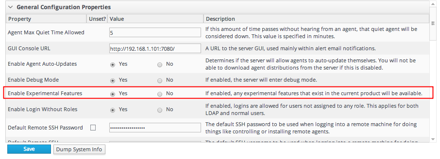
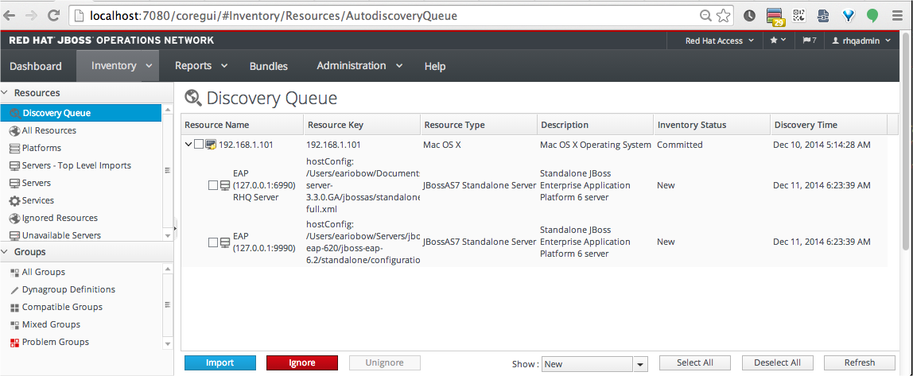
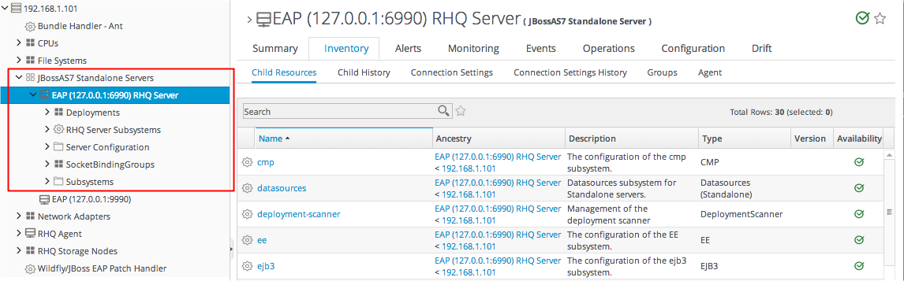

# LAB4: Menginstall JBoss EAP/AS Plugin Pack


> Sebelum memulai LAB ini, jalankan sebuah JBoss EAP server yang akan kita monitor atau manage.
> Pastikan JBoss EAP yang dijalankan memiliki file `product.conf` di direktori `bin/` yang isinya memiliki text berikut 
> `slot=eap`. Nilai slot yang berbeda akan membuat proses JBoss EAP tidak bisa di-discover (ditemukan) oleh agent JON/RHQ.

1. Downloan file JON EAP Plugin Pack (`jon-plugin-pack-eap-3.3.0.GA.zip`) dari website `http://access.redhat.com`

2. Jalankan JBoss EAP dengan perintah `./standalone.sh`

Pastikan anda telah mengubah system setting seperti tampilan dibawah ini




Lalu kik tombol [Save]


Setelah itu ekstrak file plugin installer `jon-plugin-pack-eap-3.3.0.GA.zip`, kemudian masukan ke direktori `<JON_INSTALL_DIR>/plugins/`

```
hornetq-jopr-plugin-2.0.0.Final.jar
jopr-hibernate-plugin-4.12.0.JON330GA.jar
jopr-jboss-as-5-plugin-4.12.0.JON330GA.jar
jopr-jboss-as-plugin-4.12.0.JON330GA.jar
jopr-jboss-cache-plugin-4.12.0.JON330GA.jar
jopr-jboss-cache-v3-plugin-4.12.0.JON330GA.jar
rhq-agent-plugin-4.12.0.JON330GA.jar
rhq-ant-bundle-plugin-4.12.0.JON330GA.jar
rhq-apache-plugin-4.12.0.JON330GA.jar
rhq-augeas-plugin-4.12.0.JON330GA.jar
rhq-cassandra-plugin-4.12.0.JON330GA.jar
rhq-database-plugin-4.12.0.JON330GA.jar
rhq-iis-plugin-4.12.0.JON330GA.jar
rhq-jboss-as-7-plugin-4.12.0.JON330GA.jar
rhq-jmx-plugin-4.12.0.JON330GA.jar
rhq-platform-plugin-4.12.0.JON330GA.jar
rhq-postgres-plugin-4.12.0.JON330GA.jar
rhq-rhqserver-plugin-4.12.0.JON330GA.jar
rhq-rhqstorage-plugin-4.12.0.JON330GA.jar
rhq-script-plugin-4.12.0.JON330GA.jar
```

Restart JON/RHQ server, lihat lagi list of Agen plugins di web UI dengan mengklik menu "Administration" lalu "Agent Plugins". 
Stop dengan  perintah `./rhqctl stop`.

Coba start JON/RHQ server dengan mode console sehingga output bisa terlihat di terminal, jalankan perintah `./rhqctl console --server`


Coba klik tombol "Update Plugin on Agent" lalu lihat direktori `rhq-agent/plugins/` apakah sudah ada file-file plugin jar seperti diatas? 
Kalau belum mungkin proses replikasi plugin ke agent bermasalah. Coba dengan manual copy file-file plugin tersebut ke direktori  
`rhq-agent/plugins/`

Stop JON/RHQ agent. Lalu start dengan perintah 

```
cd rhq-agent/bin/
./rhq-agent.sh -l
```

Akan muncul  prompt command (>) setelah perintah diatas, jalankan perintah plugins update
Output-nya akan seperti ini... mungkin..

```
The plugin container has been stopped gracefully (i.e. all threads have willingly terminated).
Updating plugins to their latest versions.
The agent is waiting for plugins to be downloaded...
The plugin container has been started.
```

Sekarang login lagi ke web UI dan klik menu "Inventory" lalu klik "Discovery Queue".
Anda seharusnya sekarang melihat screen yang kira-kira seperti ini:

 


Kita bisa memlihat bahwa proses JBoss EAP kita sudah ter-discover oleh agent dan agent berusaha mendaftarkannya ke JON Server sehingga 
bisa ditampilkan di web UI. Terlihat 2 EAP Server resource, karena kita memiliki 2 JBoss EAP yaitu yang kita jalankan diawal Lab ini, 
kemudian JBoss EAP yang menjalankan RHQ Server web UI.

Klik semua resource name di list "Discovery Queue" tersebut, lalu klik tombol [Import] di bawah

Setelah itu, navigasikan ke menu Inventory, klik Platforms, klik entry di kolom Name di tabel Platform. Expand menu "JBossAS7 Standalone 
Server", lalu expand lagi "EAP (127.0.0.1:6990) RHQ Server", kita akan lihat tampilan seperti ini:

 



Eksplor masing-masing menu untuk mengelola dan memonitor JBoss AS/EAP.

Selesai
