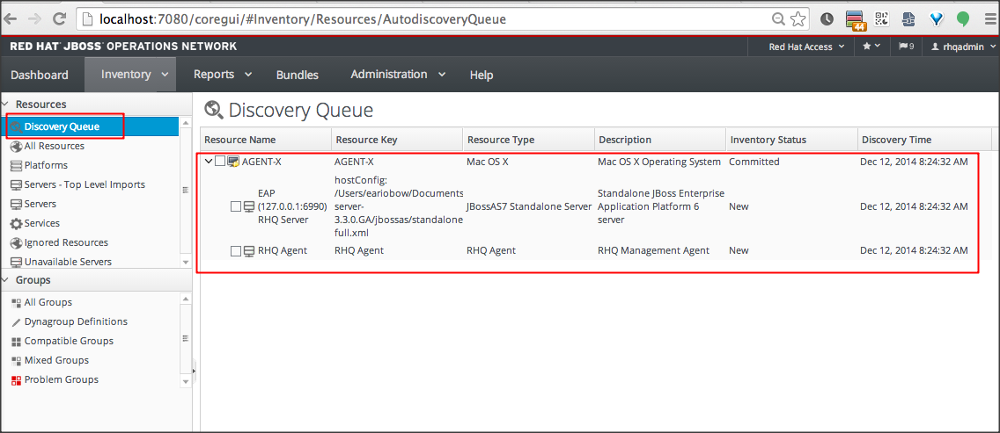
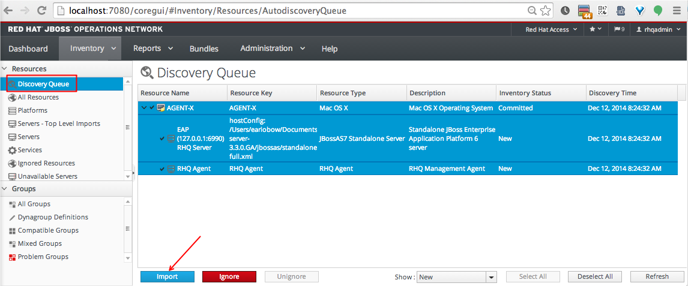

#LAB6: Memonitor resource mesin lain dengan JON/RHQ

Untuk memonitor resource dari mesin lain (resource ini bisa berarti resource OS seperti CPU, memory, disk, dan lain-lain ataupun 
aplikasi yang jalan di mesin tersebut). Mesin ini, kita namakan mesin AGENTX nantinya akan dimonitor/dikeloala (manage) oleh JON/RHQ 
server.

> Prerequisite:
>
> Yang kita butuhkan adalah sebuah mesin yang sudah menjalankan JON/RHQ Server, mesin yang sudah kita setup sebelumnya pada Lab1
> sampai Lab5. Mesin ini, kita namakan JONSVR harus bisa diakses oleh  AGENTX begitu juga sebaliknya. Dapat berkomunikasi artinya
> port 16163 dan port 7080 untuk TCP/UDP harus tidak boleh diblok oleh firewall.

Di mesin JONSVR, coba pastikan JON Server maupun JON Storage Server mati. Gunakan perintah `./rhqctl.sh status`

Buka sebuah terminal, dan mulai jalankan Storage Server dengan perintah 

```
./rhqctl console --storage
```

Buka terminal baru, dan jalankan RHQ Server dalam mode DEBUG dengan perintah

```
export RHQ_CONTROL_DEBUG=true
./rhqctl console --server
```

Di mesin AGENTX, lakukan perintah berikut untuk mendownload Agent installer file dari JONSVR.
Asumsi saya, anda menggunakan Linux dimana command wget tersedia.

```
wget -O rhq-agent.jar http://<IP_ADDRESS_JONSVR>:7080/agentupdate/download 
```

Anda bisa juga menggunakan browser untuk download file tersebut.
Setelah itu instal agent dengan perintah berikut, asumsi anda akan menginstal agent di direktori `/opt/rhq-agent/`

```
java -jar rhq-agent.jar --install=/opt/rhq-agent/
```

Lakukan interaktif setup untuk agent yang sudah kita install

```
/opt/rhq-agent/bin/rhq-agent.sh --setup 
```

Lalu jalankan agent dengan perintah:

```
./rhq-agent.sh start
```

Check di web UI yang ada di mesin JONSVR, clik "Inventory" kemudian "Discovery Queue". Pastikan ada sebuah resource name baru. 



Pilih (check) semua resource tersebut, kemudian klik tombol [Import]



Sekarang klik "Platform" di menu kiri.
Seharusnya anda bisa melihat sekarang bahwa AGENTX sudah masuk dalam inventory sehingga bisa kita manage dan monitor.

Sekarang kita coba lagi 

Beberapa command line options yang penting

```
-l atau -cleanconfig untuk membersihkan semua konfigurasi sebelumnya
-L atau -fullcleanconfig untuk memberihkan semua konfigurasi sebelumnya dan semua data
-s atau --setup untuk mode basic setup 
-a untuk advance option
```

lebih detail mengenai opsi-opsi untuk command line bisa dilihat disini


Berikut adalah output jika kita jalankan agent dengan perintah `./rhq-agent.sh -a -s`

```
RHQ 4.12.0.JON330GA [e347f77] (Tue Nov 18 02:23:34 WIT 2014)
** Advanced Setup **
Answer the following questions to setup this RHQ Agent instance.
This will ask for basic and secondary configuration preferences
thus allowing you to fine tune the agent via these advanced settings.
Please refer to the help text and documentation if you are not sure
what a setting does or what are its appropriate values.
- After each prompt, a default value will appear in square brackets.
  If you press the ENTER key without providing any value,
  the new preference value will be set to that default value.
- If you wish to rely on the system internal default value and
  not define any preference value, enter '!*'.
- If you wish to stop before finishing all the questions but still
  retain those preferences you already set, enter '!+'.
- If you wish to cancel before finishing all the questions and revert
  all preferences back to their original values, enter '!-'.
- If you need help for a particular preference, enter '!?'.

Agent Name [192.168.1.101] : AGENT-X
Agent Hostname or IP Address [!*] :
Agent Port [16163] :
Agent Transport Protocol [socket] :
Agent Transport Parameters [numAcceptThreads=1&maxPoolSize=303&clientMaxPoolSize=304&socketTimeout=60000&enableTcpNoDelay=true&backlog=200] :
RHQ Server Hostname or IP Address [192.168.0.118] :
RHQ Server Port [7080] :
RHQ Server Transport Protocol [servlet] :
RHQ Server Transport Parameters [/jboss-remoting-servlet-invoker/ServerInvokerServlet] :
RHQ Server Alias [rhqserver] :
The setup has been completed for the preferences at node [/rhq-agent/default].
The agent is waiting for plugins to be downloaded...
>
```

Perintah tersebut akan menghasilkan interactive prompt command, dimana kita bisa memberikan perintah kepada agent. Daftar perintah 
yang bisa kita jalankan bisa dilihat disini

Output di server akan terlihat seperti ini saat sebuah agent mencoba melakukan registrasi:


```
8:24:15,423 INFO  [org.rhq.enterprise.server.core.CoreServerServiceImpl] (http-/0.0.0.0:7080-7) Got agent registration request for new agent: AGENT-X[192.168.1.101:16163][4.12.0.JON330GA(e347f77)]
08:24:15,736 INFO  [org.rhq.enterprise.server.core.CoreServerServiceImpl] (http-/0.0.0.0:7080-7) Agent [AGENT-X][4.12.0.JON330GA(e347f77)] would like to connect to this server
08:24:15,823 INFO  [org.rhq.enterprise.server.core.CoreServerServiceImpl] (http-/0.0.0.0:7080-7) Agent [AGENT-X] has connected to this server at Fri Dec 12 08:24:15 WIT 2014

08:24:32,897 INFO  [org.rhq.enterprise.server.cloud.StorageNodeManagerBean] (http-/0.0.0.0:7080-8) Linking Resource[id=11083, uuid=61b871f7-d547-42a4-826f-5d15d6110dd8, type={RHQStorage}RHQ Storage Node, key=RHQ Storage Node(MyMacBook-Pro.local), name=RHQ Storage Node(MyMacBook-Pro.local), parent=AGENT-X, version=4.12.0.JON330GA] to storage node at MyMacBook-Pro.local
08:24:32,923 INFO  [org.rhq.enterprise.server.cloud.StorageNodeManagerBean] (http-/0.0.0.0:7080-8) StorageNode[id=1001, address=MyMacBook-Pro.local, cqlPort=9142, operationMode=NORMAL, mtime=1418163104688] is an existing storage node. No cluster maintenance is necessary.
08:24:32,989 INFO  [org.rhq.enterprise.server.cloud.StorageNodeManagerBean] (http-/0.0.0.0:7080-8) Updating snapshot management schedules for StorageNode[id=1001, address=MacBook-Pro.local, cqlPort=9142, operationMode=NORMAL, mtime=1418163104688]
08:24:37,027 INFO  [org.rhq.enterprise.server.cloud.instance.CacheConsistencyManagerBean] (EJB default - 4) 192.168.1.101 took [27]ms to reload global cache
08:24:37,084 INFO  [org.rhq.enterprise.server.cloud.instance.CacheConsistencyManagerBean] (EJB default - 4) 192.168.1.101 took [54]ms to reload cache for 1 agents
```
